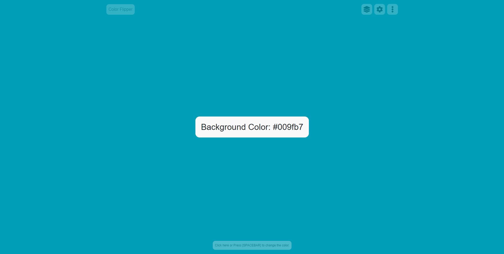

<h1 align="center">Simple Color Flipper Project</h1>

  :rainbow: :zap: :rainbow:

  <strong>Color Flipper</strong>

Fully customized color flipper with bunch of features soon

 

  <!-- License -->
  
  
  

  <h3>
    <a href="#">
      Live Demo
    </a>
     | 
    <a href="#">
      Documentation
    </a>
     | 
    <a href="#">
      Project Information
    </a>
  </h3>

  The little script that could. Built with ❤︎ by
  <a href="https://github.com/RaihanStark">Raihan Yudo Saputra</a>

## Table of Contents

- [Table of Contents](#table-of-contents)
- [Features](#features)
- [Guide](#guide)

- [Contributing](#contributing)
- [Author](#author)
- [License](#license)
- [See Also](#see-also)

## Features

- **easy to use:** does anybody still need to watch a tutorial to operate a simple apps? :frog:
- **fully customize:** you can change anything with just a tap tap :clap:
- **vanilla javascript:** it's only using a plain javascript, should be lightweight and fast :sparkles:
- **learn:** since we are using vanilla, we can learn together for those who still learning javascript :school_satchel:
- **useless:** why would you need a color flipper? :snake:

## Guide

- Click anywhere to change the colors
- To open settings tab, You just need to click settings on your top left navbar.

## Upcoming Features

- [ ] Colors Management ( Add, Edit, Delete, Shuffle, Ordering, Random, and etc )
- [ ] Display Closest Color Name
- [ ] Responsive
- [ ] Offline Support

## Contributing

Pull requests are welcome. For major changes, please open an issue first to discuss what you would like to change.

Please make sure to update tests as appropriate.

## Author

Raihan Yudo Saputra

## License

[ GNU GPLv3 ](https://choosealicense.com/licenses/gpl-3.0/)

## See Also

[ByRaihan.com](https://byraihan.com) - my website!
